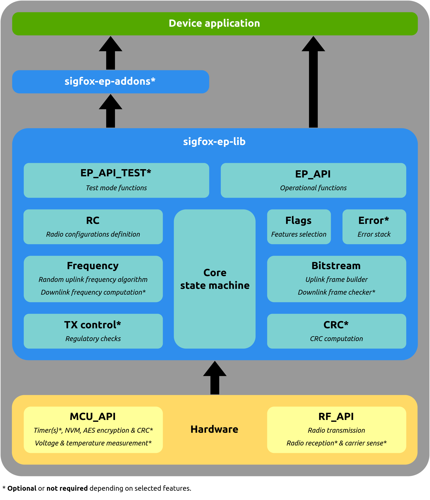

# Sigfox End-Point library (EP_LIB)

## Description

The **Sigfox End-Point library** is an example of the [Sigfox radio protocol](https://build.sigfox.com/sigfox-device-radio-specifications) implementation. The stack is designed to operate either in **blocking** or **asynchronous** mode, and supports most of **MCUs** and **radio chipsets**.

The user API is provided in the `inc/sigfox_ep_api.h` file, to send **application messages** and **control messages** over the Sigfox network.

## Stack architecture

<p align="center">

</p>

## Hardware

The stack relies on **low level drivers** (called manufacturer drivers) which need to be implemented to run on your specific hardware. There are divided in 2 groups:

* **MCU_API** : MCU related functions such as timers, non-volatile memory and encryption.
* **RF_API** : radio related functions such as uplink transmission and downlink reception.

These drivers are located in the `src/manuf` folder. 

## Code optimization

Most of Sigfox radio parameters and features are conditionned to a **dedicated flag**, so that the stack can be configured to perfectly match your application, **without dead code** and thus with a **minimum memory footprint**. The flags are located in the `inc/sigfox_ep_flags.h` file, but can also be set through the **cmake** command when building the project.

To have such a flexibilty, the stack use a lot of preprocessor directives, which makes the source code less readable. If you plan to look or modify the source files, we advise you to **run the cmake pre-compilation command**, that will remove all preprocessor directives according to your flags selection.

Below is the list of available flags.

|         **Flag name**        |                            **Value**                           |                                                                                                                  **Description**                                                                                                                 |
|:----------------------------:|:--------------------------------------------------------------:|:------------------------------------------------------------------------------------------------------------------------------------------------------------------------------------------------------------------------------------------------:|
| `RCx`                        | `undefined` / `defined`                                        | Support the RCx radio configuration if defined                                                                                                                                                                                                   |
| `APPLICATION_MESSAGES`       | `undefined` / `defined`                                        | Support uplink application messages if defined                                                                                                                                                                                                   |
| `CONTROL_KEEP_ALIVE_MESSAGE` | `undefined` / `defined`                                        | Support uplink control keep alive message if defined                                                                                                                                                                                             |
| `BIDIRECTIONAL`              | `undefined` / `defined`                                        | Support bidirectional procedure (downlink) if defined. Only applicable to application messages. Otherwise all messages will be uplink only.                                                                                                      |
| `ASYNCHRONOUS`               | `undefined` / `defined`                                        | Asynchronous mode if defined, blocking mode otherwise.                                                                                                                                                                                           |
| `LOW_LEVEL_OPEN_CLOSE`       | `undefined` / `defined`                                        | Enable MCU and RF open/close functions if defined.                                                                                                                                                                                               |
| `REGULATORY`                 | `undefined` / `defined`                                        | Enable radio regulatory control (DC, FH or LBT check) if defined.                                                                                                                                                                                |
| `LATENCY_COMPENSATION`       | `undefined` / `defined`                                        | Enable radio latency compensation to improve MCU timers accuracy.                                                                                                                                                                                |
| `SINGLE_FRAME`               | `undefined` / `defined`                                        | Send 1 frame per message (N=1) if defined. Otherwise number of frames per message is dynamically given when sending a message (N=1, N=2 or N=3).                                                                                                 |
| `UL_BIT_RATE_BPS`            | `undefined` / `100` / `600`                                    | If defined, give the only uplink bit rate supported (100 or 600 depending on the RC). Otherwise, value is dynamically given when sending a message.                                                                                              |
| `TX_POWER_DBM_EIRP`          | `undefined` / `<tx_power_dbm_eirp>`                            | If defined, give the only TX power supported by the radio. Otherwise the value is dynamically given when sending a message.                                                                                                                      |
| `T_IFU_MS`                   | `undefined` / `<t_ifu_ms>`                                     | If defined, give the fixed inter-frame delay used between uplink frames of a same message (0 to 2000ms). Value 0 disables the delay and associated timers to optimize memory space. Otherwise value is dynamically given when sending a message. |
| `T_CONF_MS`                  | `undefined` / `<t_conf_ms>`                                    | If defined, give the fixed delay between downlink frame reception and uplink confirmation message (1400 to 4000ms). Otherwise value is dynamically given when sending a message.                                                                 |
| `UL_PAYLOAD_SIZE`            | `undefined` / `<ul_payload_size>`                              | If defined, give the only uplink payload length supported (0 to 12). Value 0 enables the bit 0, bit 1 and empty messages. Otherwise, all uplink payload lengths are dynamically supported.                                                       |
| `CRC_HW`                     | `undefined` / `defined`                                        | If defined, enable hardware CRC through MCU API functions. Otherwise the embedded driver is used.                                                                                                                                                |
| `MESSAGE_COUNTER_ROLLOVER`   | `undefined` / `128` / `256` / `512` / `1024` / `2048` / `4096` | If defined, give the only message counter rollover value supported. Otherwise, value is dynamically given when opening the library.                                                                                                              |
| `PARAMETERS_CHECK`           | `undefined` / `defined`                                        | Enable parameters check if defined.                                                                                                                                                                                                              |
| `CERTIFICATION`              | `undefined` / `defined`                                        | Enable certification features if defined.                                                                                                                                                                                                        |
| `PUBLIC_KEY_CAPABLE`         | `undefined` / `defined`                                        | Enable public key switch feature if defined.                                                                                                                                                                                                     |
| `VERBOSE`                    | `undefined` / `defined`                                        | Enable credentials (ID / PAC) API access and version control functions if defined.                                                                                                                                                               |
| `ERROR_CODES`                | `undefined` / `defined`                                        | Use return codes if defined, otherwise all functions return void.                                                                                                                                                                                |
| `ERROR_STACK`                | `undefined` / `<error_stack_depth>`                            | If defined, store low level errors in a stack (the macro gives the depth). Errors can be read with the `SIGFOX_EP_API_unstack_error()` function.                                                                                                 |

## Getting Started

### Cloning the repository

```bash
$ git clone https://github.com/sigfox-tech-radio/sigfox-ep-lib.git
```

### Usage

This library can be used in 3 different ways:
 * The [original source code](#original-source-code) to use the raw sources files
 * The [precompiled source code](#precompiled-source-code) to remove all unused source code and have more readability.
 * The [static-library](#static-library) to generate a compiled library.

### Original source code

Sources files are available in the `inc` and `src` folders and must be copied directly in your embedded project. Then you can customize the `inc/sigfox_ep_flags.h` according to your flags selection.

### Precompiled source code

#### Dependency

Before building process install **unifdef** and  **cmake**. The unifdef tool is used to remove dead code and cmake to build.

#### Building process

If you want to **precompile** the sources files for a given flags selection, you need to use the **cmake** commands:

Create a build folder:

```bash
$ cd sigfox-ep-lib
$ mkdir build
$ cd build
```

* Precompiling by reading the `inc/sigfox_ep_flags.h` file:

```bash
$ cmake -DUSE_SIGFOX_EP_FLAGS_H=ON ..
$ make precompil
```
* Precompiling by entering the flags selection on command line:

```bash
$ cmake -DUSE_SIGFOX_EP_FLAGS_H=OFF \
        -DRC1=ON \
        -DRC2=ON \
        -DRC3C=ON \
        -DRC3D=ON \
        -DRC4=ON \
        -DRC5=ON \
        -DRC6=ON \
        -DRC7=ON \
        -DAPPLICATION_MESSAGES=ON \
        -DCONTROL_KEEP_ALIVE_MESSAGE=ON \
        -DBIDIRECTIONAL=ON \
        -DASYNCHRONOUS=ON \
        -DLOW_LEVEL_OPEN_CLOSE=ON \
        -DREGULATORY=ON \
        -DLATENCY_COMPENSATION=ON \
        -DSINGLE_FRAME=ON \
        -DPARAMETERS_CHECK=ON \
        -DCERTIFICATION=ON \
        -DPUBLIC_KEY_CAPABLE=ON \
        -DVERBOSE=ON \
        -DCRC_HW=OFF \
        -DERROR_CODES=ON \
        -DUL_BIT_RATE_BPS=OFF \
        -DT_IFU_MS=OFF \
        -DT_CONF_MS=OFF \
        -DUL_PAYLOAD_SIZE=OFF \
        -DMESSAGE_COUNTER_ROLLOVER=OFF \
        -DERROR_STACK=12 ..
$ make precompil
```

The precompiled files will be generated in the `build/precompil` folder.

### Static library

If you want to build a **static library**, you need to run this additionnal **cmake** command:

```bash
$ make sigfox_ep_lib
```

The archive will be generated in the `build/lib` folder.


## Addons

### RF & Protocol

In order to **test your implementation** against Sigfox specifications, you can use the [Sigfox End-Point RF & Protocol addon](https://github.com/sigfox-tech-radio/sigfox-ep-addon-rfp) which will drive the library to perform some test modes.

The addon can be directly generated from the Sigfox End-Point library **cmake** by using the `ADDON_RFP` option:

```bash
$ cmake <all previous flags> -DADDON_RFP=ON ..
$ make precompil_sigfox_ep_addon_rfp
$ make sigfox_ep_addon_rfp
```

## RF API implementation examples


### ST S2LP

The [S2LP RF API example code](https://github.com/sigfox-tech-radio/sigfox-ep-rf-api-st-s2lp) can be directly generated from the Sigfox End-Point library **cmake** by using the `S2LP_RF_API` option:

```bash
$ cmake <all previous flags> -DS2LP_RF_API=ON ..
$ make precompil_s2lp_rf_api
$ make s2lp_rf_api
```

### Semtech LR11XX

The [LR11XX RF API example code](https://github.com/sigfox-tech-radio/sigfox-ep-rf-api-semtech-lr11xx) can be directly generated from the Sigfox End-Point library **cmake** by using the `LR11XX_RF_API` option:

```bash
$ cmake <all previous flags> -DLR11XX_RF_API=ON ..
$ make precompil_lr11xx_rf_api
$ make lr11xx_rf_api
```
